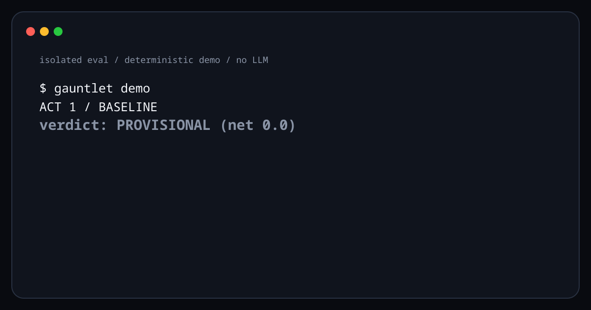

# gauntlet

[](https://github.com/dhanizael/gauntlet/actions/workflows/ci.yml)
[](https://pypi.org/project/gauntlet-guard/)
[](https://pypi.org/project/gauntlet-guard/)
[](LICENSE)

## YOUR AI DIDN'T GET SMARTER.

## IT GOT THE ANSWERS.

An agent can look dramatically better after it has seen the test. Gauntlet shows
whether that score survives a fresh one.

```bash
uvx --from gauntlet-guard gauntlet demo
```

**Eight seconds. $0. No LLM. Deterministic.** The demo makes an agent look
better on the same test, catches the leaked memory, and asks the claim to
survive a fresh holdout.



**[Run the proof](#quickstart)** · **[Read the real self-audit](docs/CASE_STUDY.md)** · **[Inspect the protocol](docs/RUN_PROTOCOL.md)** · **[Use the share card](docs/assets/gauntlet-social-card.png)**

## Why this happens

None of this requires malice. It takes one good feature and one reused task set.
Memory, logs, and result directories quietly become the open book for the next exam:

- `MEMORY.md` / `LESSONS.md` / `now.md` — "what I learned this run" writes, verbatim,
  the task you just evaluated it on;
- saved trajectories & transcripts — the full prompt survives in a log directory the
  next session retrieves from;
- result/eval output directories — fixtures copied into run artifacts stay agent-readable;
- vector stores / retrieval memory — the paraphrase you thought was safe is 6 shingles
  away from a `near` hit;
- generated helper artifacts — the "summary" file that quotes the task to explain it.

If your agent stack has any of the above, your evals can measure memory and
capability as one number. Gauntlet separates them: sealed run → blind grade →
content-free memory scan → retire the leaked holdout → fresh test.

## Quickstart

```bash
pipx install gauntlet-guard        # or: uv tool install gauntlet-guard
uvx --from gauntlet-guard gauntlet guard selftest   # prove the scanner before trusting it

# the loop, end to end:
gauntlet run init exp --tasks tasks.json --arms harness,raw --repeats 3
gauntlet run prep   exp --slot t-xxxxxxxx --fixtures fx/
gauntlet run exec   exp --slot t-xxxxxxxx -- python3 my_agent.py
gauntlet run blindpack exp --out pack              # pseudonyms only; judges see no arms
gauntlet run status exp
gauntlet grade    exp --primary harness --baseline raw
# exit code IS the verdict: 0 keep · 1 revert · 2 provisional · 3 integrity failure

# the memory audit:
gauntlet manifest add ~/.private/eval/manifest.jsonl --instance task-0001 --seed s-77 prompt.txt
gauntlet guard scan   ~/.private/eval/manifest.jsonl --store ~/agent/LESSONS.md --store ~/agent/logs/
# findings cite hash references, never content — safe to paste into issues
```

## We ran our own gauntlet first

The first real scan target was the author's actual agent infrastructure: 12 sealed
task instances, scanned against long-term memory files, journal logs, working-state
directories, and evaluation run results. 271 files, **3.1 seconds**, zero runtime
dependencies. The agent's memory files were **clean** — but task fixtures had
persisted verbatim into run-result directories: real, previously uncounted
contamination vectors, calibrated correctly (`NEAR` for fixture content, `TRACE` for
shared boilerplate). A control scan of unrelated notes: zero false positives. The
machine-readable report contains **zero task text** — verified by assertion in CI.

## Design principles

1. **The scanner must not leak.** Findings are file, position, counts, hash
   references — never matched text. The report is safe to publish even when the task
   is secret. ([ADR-0002](docs/adr/0002-redaction-contract.md))
2. **Manifests are private keys.** Task content lives only in the manifest; keep it
   out of every agent-readable surface. ([ADR-0007](docs/adr/0007-private-side-doctrine.md))
3. **Deterministic first, judge second.** Shingle/hash evidence outranks LLM opinion;
   judges enter only as external blind score files. ([ADR-0006](docs/adr/0006-deterministic-first-external-judges.md))
4. **Leaks are lifecycle events, not warnings.** Detection → retire → regenerate from
   an unused seed. A holdout that leaked once is dead.
5. **Verdicts over scores.** `keep / revert / provisional` with ≥N repeats and
   reported spread; **provisional means the claim failed to be proven.**
   ([ADR-0005](docs/adr/0005-provisional-is-absence-of-proof.md))
6. **Decisions are written before they are implemented.** The verdict engine's rules
   were frozen in [docs/GRADE_DESIGN.md](docs/GRADE_DESIGN.md) before the code existed;
   the demo asserts its own narrative in CI.

## Status

| module | what it is | state |
|---|---|---|
| `guard` + `manifest` (v0.1) | persistence-leak scanner, content-free reports | shipped |
| `run` (v0.2) | sealed isolated trials: opaque slots, drift forensics, blind packs | shipped |
| `grade` (v0.3) | preregistered verdict engine, bootstrap CI, exit codes as verdicts | shipped |
| `demo` (v0.3.2) | the three-act failure mode, $0, self-asserting in CI | shipped |
| `holdout` (v0.4) | fresh-instance generation + retirement ledger | next |

Built from a battle-tested private protocol: doctrine changes stay `PROVISIONAL`
until they beat the previous version on repeated, holdout-guarded evals. gauntlet is
that gauntlet, made a tool.

## The repo is the receipt

Decisions precede code and both are public: **[docs/adr/](docs/adr/)** records every
frozen call (10 ADRs, including one that killed a version-inflating release),
**[ROADMAP.md](ROADMAP.md)** pins non-goals as firmly as targets,
**[SECURITY.md](SECURITY.md)** treats "silent untrustworthiness" as the vulnerability
class, **[CONTRIBUTING.md](CONTRIBUTING.md)** states the gates honestly (unmasked exit
codes, dual-version verification), and the
**[negative-result issue template](.github/ISSUE_TEMPLATE/negative_result.md)** is what
measurement culture should look like.

## Development

```bash
uv sync
uv run pytest                          # 50 tests, incl. the demo's self-assertion
uv run ruff check && uv run ruff format --check
uv run ty check src/
uv run gauntlet demo                   # the story must hold, or CI goes red
```

## License

MIT
